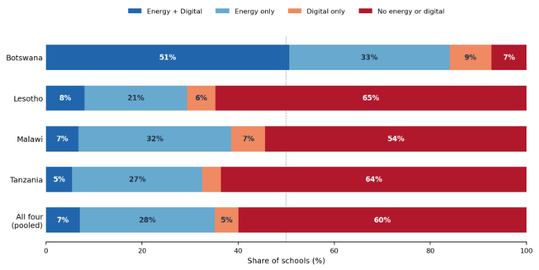
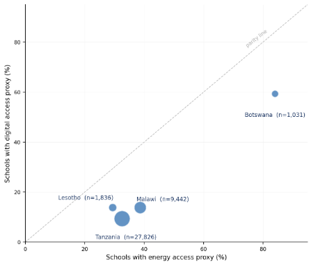
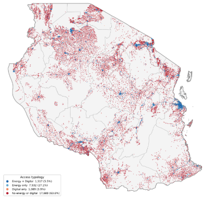
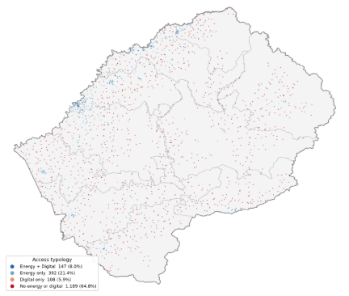
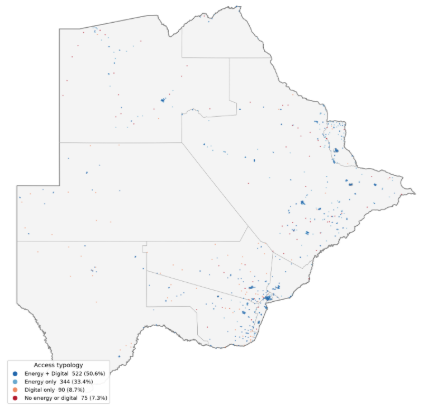
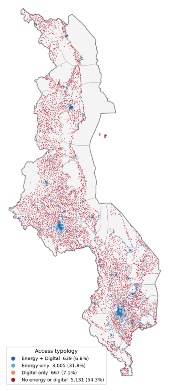

## Illustrative Application: School-Level Energy and Connectivity Access Across Four M300 Focus Countries

This section presents the results of an initial geo-spatial diagnostic assessing, at the level of individual schools, the joint availability of two foundational services: electricity and mobile connectivity. The analysis covers four countries — **Botswana, Lesotho, Malawi and Tanzania** — and a total of **40,135 schools**.

Each school is assigned to one of four mutually exclusive categories by crossing an energy access proxy with a digital access proxy: (i) Energy + Digital, (ii) Energy only, (iii) Digital only, and (iv) Neither. The purpose is not to count connected facilities, but to establish where the two gaps overlap, where they diverge, and what that implies for the sequencing and bundling of interventions.

### Data

| Access Type | Data | Description |
| --- | --- | --- |
| School locations and connectivity | UNICEF Giga (`schools_location` and `schools_profile` endpoints) | A school is treated as digitally served where a real-time connection is confirmed or a specific connection technology is on record. |
| Energy access | World Bank Global Electrification Platform (GEP v3), base-year (2020) electrification status of the settlement cluster | Energy status is modelled at settlement level, not per building, so a school in a low-electrification cluster may not itself be served. School points were joined to GEP settlement clusters; points falling just outside a cluster boundary were matched to the nearest cluster within 2 km (median offset 81 m) and treated as unelectrified beyond that. Final match rate was 100%, with 76% falling directly within a cluster polygon. |

### Headline Results

**Table: School access typology by country** *(percentages are shares of each country's school total)*

| Country | Schools | Energy + Digital | Energy only | Digital only | Neither |
| --- | --- | --- | --- | --- | --- |
| Botswana | 1,031 | 522 (50.6%) | 344 (33.4%) | 90 (8.7%) | 75 (7.3%) |
| Lesotho | 1,836 | 147 (8.0%) | 392 (21.4%) | 108 (5.9%) | 1,189 (64.8%) |
| Malawi | 9,442 | 639 (6.8%) | 3,005 (31.8%) | 667 (7.1%) | 5,131 (54.3%) |
| Tanzania | 27,826 | 1,517 (5.5%) | 7,532 (27.1%) | 1,089 (3.9%) | 17,688 (63.6%) |
| **Total** | **40,135** | **2,825 (7.0%)** | **11,273 (28.1%)** | **1,954 (4.9%)** | **24,083 (60.0%)** |

**Figure 1. Composition of the school access typology by country and pooled across all four**

**Figure 2. Schools with an energy access proxy vs. schools with a digital access proxy, by country** *(bubble size = number of schools; dashed line = parity)*

### Findings

**a. The dual gap is the majority condition.**
Across the four countries, 60% of schools — 24,083 of 40,135 — have neither an electricity nor a connectivity proxy. In three of the four countries the dual-gap share exceeds half of all schools: 65% in Lesotho, 64% in Tanzania and 54% in Malawi. Only Botswana falls outside this pattern, at 7%. The dual gap is not a residual category to be addressed after single-service programs; in most of these markets it is the predominant condition of the school facilities — precisely the situation a bundled delivery model is designed to address.

**b. Even where energy is available, dual service is rare.**
Excluding Botswana, the share of schools with an energy proxy sits between 29% and 39%. Because connectivity does not reliably accompany electrification, the share of schools with both services falls into the single digits — 8.0% in Lesotho, 6.8% in Malawi and 5.5% in Tanzania — underscoring the need for a co-deployed approach.

**c. Electrification has not translated into connectivity.**
Of the 14,098 schools with an energy access proxy across the four countries, 80% remain unconnected. The pattern holds even where infrastructure is comparatively strong: in Botswana, where 84% of schools have energy access and half have both services, 40% of electrified schools still lack connectivity. In Tanzania and Malawi the figure exceeds 80%. This is direct evidence that the sequencing assumed by siloed delivery — electrify first, connect later — is not occurring in practice.

**d. Country contexts differ sharply, and require different entry points.**
The share of schools lacking both services ranges from 7% in Botswana to 65% in Lesotho — a factor of nine. In Botswana, where half of schools already have both services, the operational question is service quality and closing a residual connectivity gap at already-electrified sites. In Tanzania, Malawi and Lesotho, the binding question is how to aggregate tens of thousands of dual-gap sites into procurement lots large enough to attract credible providers.

### Implications

**Table: Access category and corresponding operational implication**

| Category | Schools | Operational implication |
| --- | --- | --- |
| Neither | 24,083 (60.0%) | Both services are absent, so an intervention would need to address the two gaps together rather than sequentially. The size of this group indicates sufficient sites exist to support aggregation, though lot composition cannot be determined from access status alone. |
| Energy only | 11,273 (28.1%) | Power is already within reach, removing what is typically the binding constraint for network equipment. Largest set of sites where the remaining gap is connectivity alone. |
| Digital only | 1,954 (4.9%) | A nearby network presence suggests existing demand and a possible anchor load for energy investment. |
| Energy + Digital | 2,825 (7.0%) | Both proxies are positive, so the relevant question shifts to service quality and reliability — neither of which this analysis measures. May serve as comparison points for monitoring. |

### Country Maps

Each map shows all schools in the country, colored by access category. Legends report counts and shares.

**Tanzania** (N = 27,826 schools)

**Lesotho** (N = 1,836 schools)

**Botswana** (N = 1,031 schools)

**Malawi** (N = 9,442 schools)

